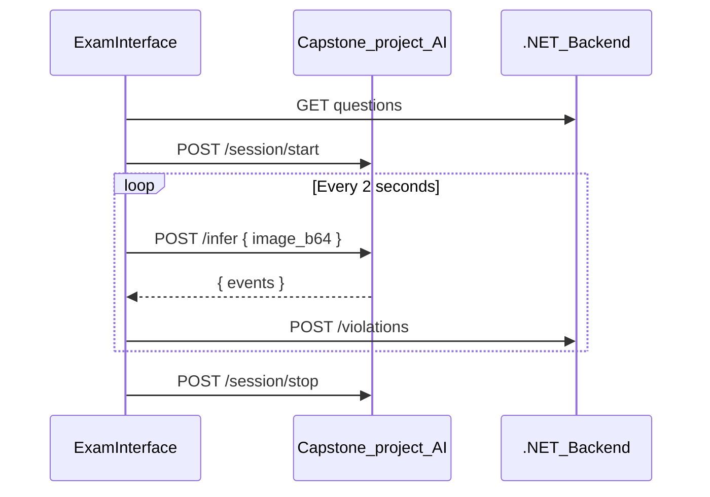
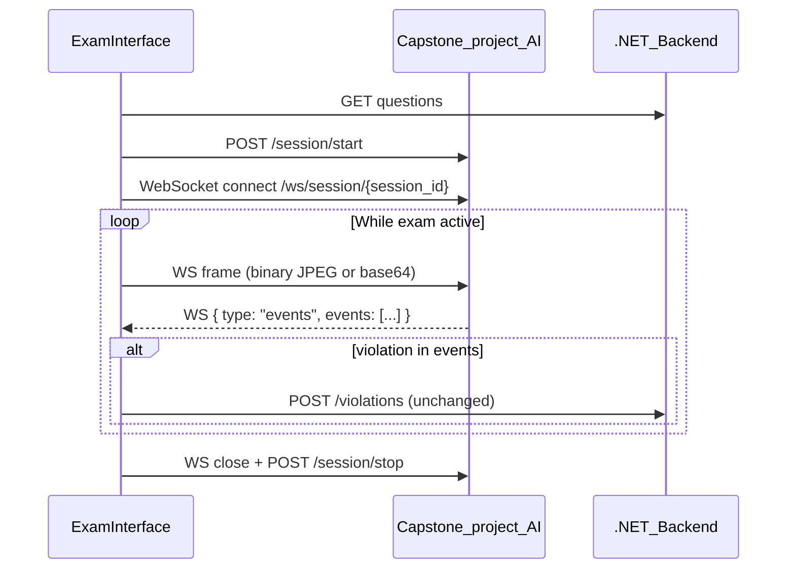

# Real-Time Student ↔ AI Integration (WebSocket)

## Current state

Today, [`ExamInterface.tsx`](D:\Programming\Capstone Project\src\components\ExamInterface.tsx) runs a `setInterval(..., 2000)` loop that:

1. Captures a webcam JPEG every 2 seconds
2. `POST`s it to `http://localhost:8000/infer`
3. Maps returned `events` to violation types
4. `POST`s each violation to the main backend via [`submitViolation()`](D:\Programming\Capstone Project\src\services\examService.ts) → `POST /exam-attempts/{attemptId}/violations`



**Problems with current approach:**
- New HTTP request + JSON base64 payload every 2s (high overhead)
- Fixed 2s latency floor for detections
- `session_id` from `/session/start` is stored but **never sent** to `/infer`
- AI URL hardcoded; no env config

**What stays the same (per your clarification):**
- Violation persistence stays on the existing REST path — no backend changes required
- Event mapping (`gaze_away` → `eye_away`, etc.) stays in the frontend
- Tab-switch / fullscreen violations continue to call `submitViolation()` directly

---

## Target architecture



WebSocket handles **transport only** between student browser and AI service. The .NET backend remains the source of truth for violations — exactly as today.

---

## Recommended approach: WebSocket on AI service

**Why WebSocket over SSE:** SSE is server→client only. Proctoring needs bidirectional frame upload + event push. WebSocket is the right fit and FastAPI/Starlette supports it natively.

**Why not WebRTC (for now):** Higher complexity (signaling, TURN/STUN). WebSocket with throttled JPEG frames is sufficient for MVP and matches your current image-based inference pipeline.

---

## Changes by repo

### 1. Capstone-project-AI (Python/FastAPI)

Add a WebSocket endpoint alongside existing REST (keep `/infer` during migration):

| Message direction | Format | Purpose |
|---|---|---|
| Client → Server | Binary JPEG **or** `{ "type": "frame", "image_b64": "..." }` | Stream webcam frames |
| Server → Client | `{ "type": "events", "events": [{ "type": "gaze_away", ... }] }` | Push detections as they happen |
| Server → Client | `{ "type": "ack", "frame_id": N }` | Optional backpressure signal |
| Either | `{ "type": "ping" }` / `{ "type": "pong" }` | Keepalive |

**Endpoint:** `WS /ws/session/{session_id}`

**Session lifecycle:**
- Reuse existing `POST /session/start` → returns `session_id`
- WebSocket connects using that ID (validates session exists)
- On disconnect or `POST /session/stop`, clean up session state

**Processing model:**
- Receive frame → enqueue → run same inference logic currently used by `/infer`
- Push events immediately over WS when detected (no waiting for next poll)
- Drop/skip frames if queue is backed up (prefer fresh frames over stale ones)

**CORS:** Ensure WebSocket origin allows the Vite dev server (`http://localhost:3000`) and production frontend origin.

---

### 2. Capstone Project frontend (React)

**New files:**

- [`src/config/ai.ts`](D:\Programming\Capstone Project\src\config\ai.ts) — `VITE_AI_SERVICE_URL` (default `http://localhost:8000`), helper to derive `ws://` URL
- [`src/services/aiProctorService.ts`](D:\Programming\Capstone Project\src\services\aiProctorService.ts) — WebSocket client with:
  - `startSession()` → REST `/session/start`
  - `connect(sessionId)` → open WS
  - `sendFrame(blob)` → push frame
  - `onEvents(callback)` → register handler for AI events
  - `stop()` → close WS + REST `/session/stop`
  - Reconnect with exponential backoff (max 3–5 retries)
  - Fallback to REST `/infer` if WS fails after retries

**Refactor [`ExamInterface.tsx`](D:\Programming\Capstone Project\src\components\ExamInterface.tsx):**

Extract the AI `useEffect` (lines ~86–209) to use `aiProctorService` instead of `setInterval` + `fetch('/infer')`.

**Frame capture:** Replace fixed 2s interval with a configurable throttle (e.g. 500ms–1000ms via `requestAnimationFrame` + timestamp check). Faster than 2s without the HTTP overhead of REST.

**Violation handling — unchanged backend contract:**

```typescript
// When WS message arrives with events:
for (const event of events) {
  const mappedType = mapAiEventToViolationType(event.type);
  if (mappedType) {
    await submitViolation(attemptId, {
      questionId: questions[currentQuestionRef.current]?.questionId || 0,
      violationType: mappedType,
      description: `AI detected: ${event.type}`,
      durationSeconds: 0,
    });
  }
}
```

This is the same call path as today — no .NET backend changes.

**Optional dedup:** Track recent violation types with a short cooldown (e.g. 5s) to avoid flooding the backend if AI sends repeated `gaze_away` events for the same incident.

---

### 3. Capstone project backend (.NET)

**No changes required** for this scope. The existing [`LogViolation`](D:\Programming\Capstone project backend\Backend\QuizMonitor.API\Controllers\ExamAttemptsController.cs) endpoint continues to receive violations from the frontend exactly as it does now.

---

## Environment config

Add to frontend `.env`:

```
VITE_AI_SERVICE_URL=http://localhost:8000
```

Add Vite proxy in [`vite.config.ts`](D:\Programming\Capstone Project\vite.config.ts) (optional, avoids CORS in dev):

```typescript
server: {
  proxy: {
    '/ai': {
      target: 'http://localhost:8000',
      changeOrigin: true,
      rewrite: (path) => path.replace(/^\/ai/, ''),
      ws: true,
    },
  },
}
```

Then frontend uses `/ai/session/start` and `ws://localhost:3000/ai/ws/session/{id}` in dev.

---

## Migration strategy

1. **Phase 1 — AI service:** Add WS endpoint; keep `/infer` working
2. **Phase 2 — Frontend:** Add `aiProctorService`; feature-flag WS vs REST (`VITE_AI_USE_WEBSOCKET=true`)
3. **Phase 3 — Validate:** Run exam with WS; confirm violations still appear in backend/instructor UI
4. **Phase 4 — Cleanup:** Remove `setInterval` + `/infer` path once stable

---

## Error handling

| Scenario | Behavior |
|---|---|
| WS disconnect mid-exam | Auto-reconnect; resume frame streaming |
| Reconnect fails | Fall back to REST `/infer` at 2s interval |
| AI service down | Log error; show non-blocking warning to student; tab-switch violations still work |
| Backend violation POST fails | Log + retry once; don't block exam |

---

## Testing checklist

- Start exam → WS connects after `/session/start`
- AI detects gaze away → violation POSTed to .NET backend (verify in DB/Swagger)
- Disconnect/reconnect during exam → session resumes
- Submit exam → WS closes, `/session/stop` called
- Kill AI service → graceful degradation or clear error state
- Compare violation latency: should be noticeably faster than 2s polling

---

## Out of scope (confirmed)

- Instructor live violation feed (SignalR on .NET backend)
- Changes to violation API or data model
- WebRTC / live video streaming to instructors
